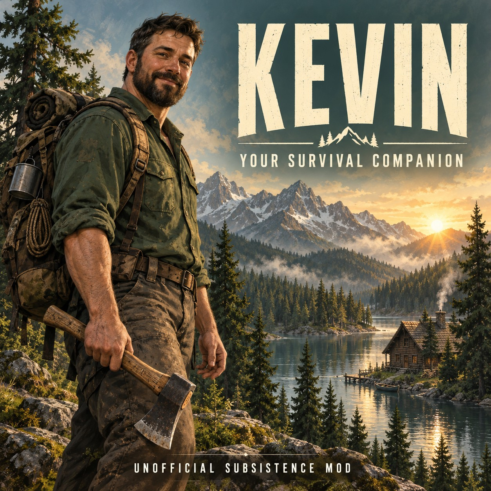
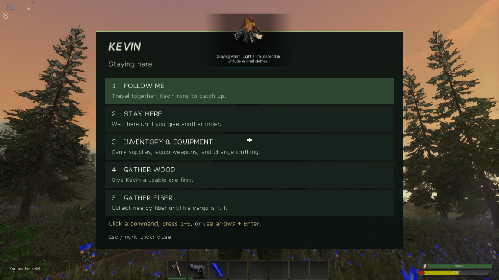

# Kevin Companion for Subsistence

**0.2.1 preview · Subsistence Alpha 68.19 · Windows · Single-player**

A friend for the wilderness. Kevin joins you automatically, carries the supplies
you cannot leave behind, wears the gear you give him, and helps defend against
immediate threats. Send him to gather nearby wood or fiber while you work.

Version **0.2.1 links the local installer to the Steam Workshop item**. Its
companion gameplay is unchanged from 0.2.0.

## Install

1. [Subscribe to Kevin Companion on Steam Workshop](https://steamcommunity.com/sharedfiles/filedetails/?id=3816609201).
2. Close Subsistence. [Download Kevin Setup 0.2.1](https://github.com/SimpleNeb/Subsistence-Kevin/raw/7d4ddfba7c9aeac9cfb2e7e19fbf41fe124fa3ec/downloads/Kevin-Setup-0.2.1-preview-Alpha68.19.exe),
   open it, and choose **Install / Update**. Setup finds your Steam game folder;
   choose **Browse** if needed.
3. Start Subsistence, select **Kevin Companion** in your profile's **Mods** list,
   and start or continue that profile. Kevin needs no recruitment quest.

**The Setup step is required.** A Workshop subscription alone cannot install
Kevin's companion code. Run Setup again when updating; you do not need to
compile anything or enter account credentials into the installer.

Already using the supported **0.1.0 or 0.2.0 preview**? Close the game and run
the new Setup's **Install / Update**. It preserves the required backups and
compatibility package. The installer does not rewrite your saves.

Prefer a ZIP? [Download the 0.2.1 ZIP installer](https://github.com/SimpleNeb/Subsistence-Kevin/raw/7d4ddfba7c9aeac9cfb2e7e19fbf41fe124fa3ec/downloads/Kevin-Companion-0.2.1-preview-Alpha68.19.zip),
extract the complete archive, and double-click **Install Kevin.cmd**. Use either
Setup or the ZIP; you do not need both.

## Spend a day with Kevin

| What you want to do | Control |
| --- | --- |
| Open his inventory | Stand nearby and press your normal **Use** key |
| Give an order | Crouch nearby and press **Use** |
| Choose a command | Click, press **1–5**, or use the arrows and **Enter** |
| Close the menu | **Escape** or right-click |
| Revive him from his dropped bag | Crouch by the bag and press **Use** |
| Loot his dropped bag | Stand by the bag and press **Use** |

His commands are **Follow Me**, **Stay Here**, **Inventory & Equipment**,
**Gather Wood**, and **Gather Fiber**. Wood gathering needs a usable axe;
fiber gathering needs no tool. Axes wear, trees deplete and plants are picked.
Stay nearby and repeat a gathering order after a reload, revival or combat.

Kevin offers **35 cargo slots**, plus weapon and clothing slots. Give him a
supported firearm and matching ammunition: he uses what he actually carries.
Drag items into his inventory; shift-clicking items into Kevin is disabled.

If he dies, his belongings stay in his bag. Revive him there or wait about two
minutes while the world is running for his return on safe outdoor ground.
He returns with half health and an empty inventory, so recover and re-equip
his belongings. The game's normal loot-bag expiry still applies.

Read the [player guide](PLAYER-GUIDE.md) for weapons, equipment, gathering,
revival and save behavior.

## Disable and compatibility

Remove Kevin from one profile's Mods selection to disable him there. To disable
him everywhere, close the game and choose **Disable Kevin** in Setup. Keep the
game's `.KevinLoader` folder and `KevinCompanion.u`; existing Kevin saves need
his saved classes and the installer needs its original-file backups.

This is an outdoor companion preview for **Alpha 68.19**. Bases, caves, terrain
and obstacles can interrupt movement or gathering. There is no teleport catch-up.
Multiplayer, building jobs and direct player control of Kevin are not included.
Setup refuses unsupported game builds and conflicting file changes.

[Build and validation details](BUILD-PROOF.md) distinguish the inherited gameplay
checks from the new Workshop and installer checks. Setup is an unsigned community
preview; SHA256 checksums accompany the downloads. Report issues with your game
build and Kevin version.

Created by **SimpleNeb**. Unofficial and not affiliated with Subsistence's
developer. The cover is an illustration; the menu image is a gameplay screenshot.
You need your own copy of Subsistence. Original game files and the SDK are not
distributed with this project.
